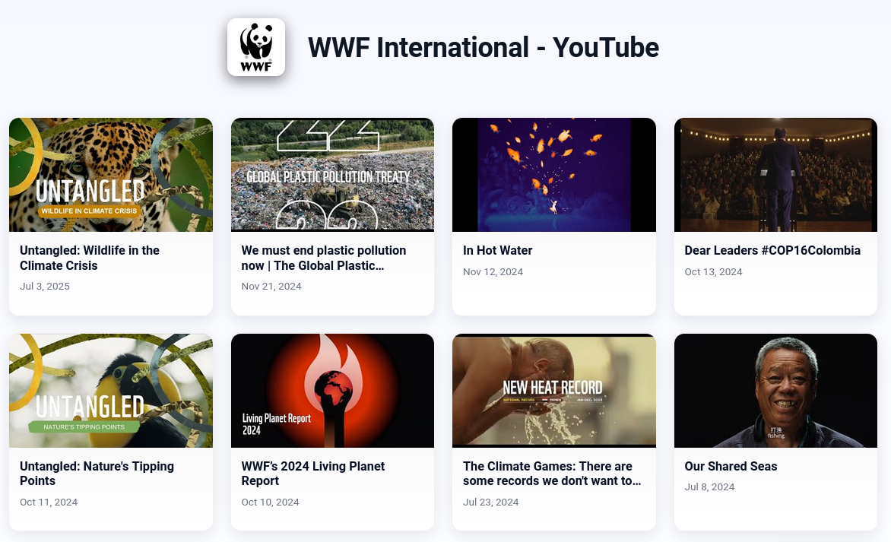
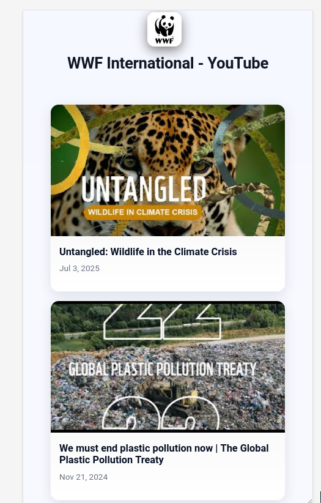
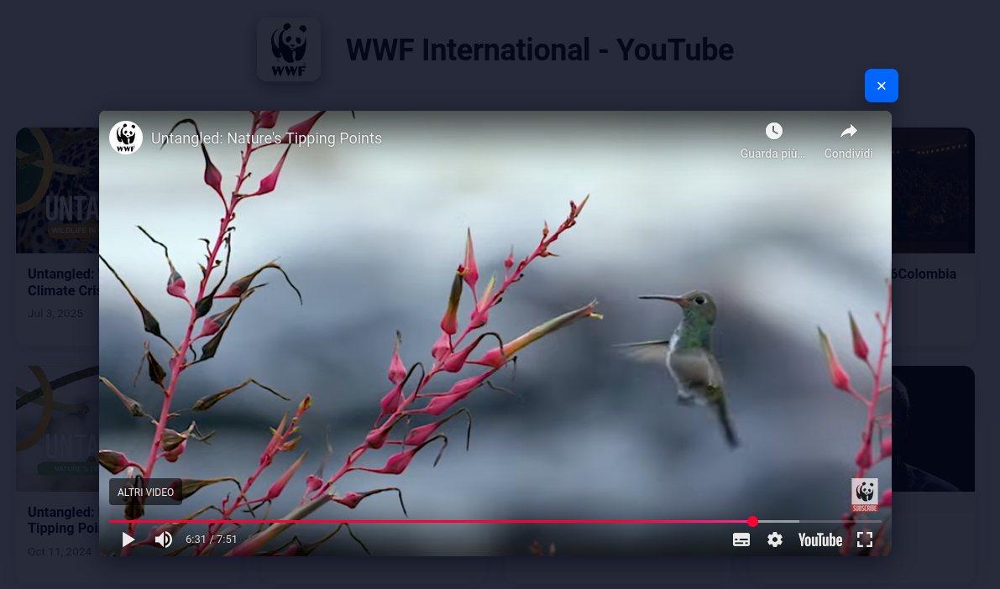

# YouTube API Video Gallery


## Description

A simple, high-performance video gallery that uses PHP for Server-Side Rendering (SSR) and React for client-side hydration. This hybrid approach delivers a very fast initial load and good search engine indexing (SEO), while still providing a smooth, interactive user experience.

## Key Features

- **Server-Side Rendering (SSR):** The initial page is fully rendered on the server with PHP to reduce perceived load time.
- **React Hydration:** React takes over on the client to manage interactivity such as infinite scroll and video playback.
- **Server-Side Caching:** YouTube API data is cached on the server for a configurable period to drastically reduce API calls and protect against quota limits.
- **Dynamic Metadata:** The page title and channel logo are fetched and updated dynamically.
- **Configurable Lightbox:** Videos can open in a modal lightbox or in a new browser tab via a configuration option.
- **Externalized Configuration:** All settings are managed in a single `config.json` file.

## Installation and Run

1. **Prerequisites:** Make sure you have [PHP](https://www.php.net/manual/en/install.php) installed on your system, including the `curl` and `json` extensions.
2. **Clone the repository:**
    ```bash
    git clone <REPOSITORY_URL>
    cd <REPOSITORY_FOLDER>
    ```
3. **Configuration:** Rename `config.json.example` to `config.json` (if present) and add your credentials. If the file does not exist, create it following the structure below.
4. **Start the server:** Run PHP's built-in development server.
    ```bash
    php -S localhost:8000
    ```
5. **Open in browser:** Visit `http://localhost:8000`.

## Configuration (`config.json`)

This file contains all application settings.

```json
{
  "apiKey": "YOUR_API_KEY_HERE",
  "channelId": "YOUTUBE_CHANNEL_ID_HERE",
  "fallbackLogoUrl": "FALLBACK_LOGO_URL",
  "fallbackTitle": "Fallback Title",
  "openInLightbox": true,
  "cacheDurationHours": 6
}
```

- `apiKey`: Your API key for the YouTube Data API v3.
- `channelId`: The YouTube channel ID you want to display videos from.
- `fallbackLogoUrl`: A URL to an image used as a logo if dynamic retrieval fails.
- `fallbackTitle`: A title to use if dynamic retrieval fails.
- `openInLightbox`: Set to `true` to open videos in a lightbox, or `false` to open them in a new tab.
- `cacheDurationHours`: Number of hours the API data is kept in the server cache.

---

### How to Get the API Key and Channel ID

#### YouTube API Key

1. **Go to Google Cloud Console:** https://console.cloud.google.com/
2. **Create a new project:** If you don't already have one, create a new project.
3. **Enable the YouTube API:**
    - In the navigation menu, go to "APIs & Services" > "Library".
    - Search for "YouTube Data API v3" and enable it for your project.
4. **Create credentials:**
    - Go to "APIs & Services" > "Credentials".
    - Click "CREATE CREDENTIALS" and choose "API key".
    - Copy the generated key and paste it into your `config.json`.
    - Important: For security, it is recommended to restrict the API key to only allow requests from your website's domains.

#### Channel ID

1. **Visit the channel page:** Open the main page of the YouTube channel you want.
2. **Find the ID in the URL:** The channel ID starts with `UC` and is present in the URL.
    - Example: `https://www.youtube.com/channel/UC5MDIy3yhWDrx0MyDo4QmYg`
    - In this example, the channel ID is `UC5MDIy3yhWDrx0MyDo4QmYg`.
3. **Copy the ID** and paste it into your `config.json`.

<h2>Screenshots</h2>

<p>Desktop:</p>


<p>Mobile:</p>


<p>Lightbox:</p>

